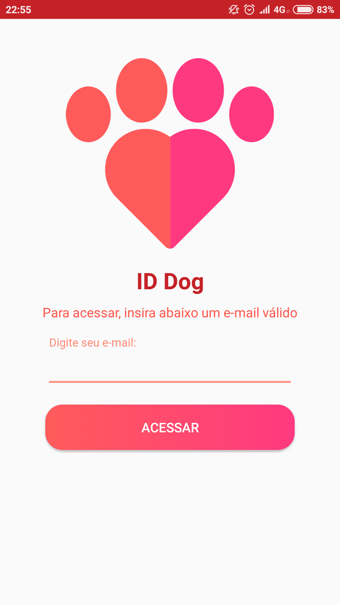
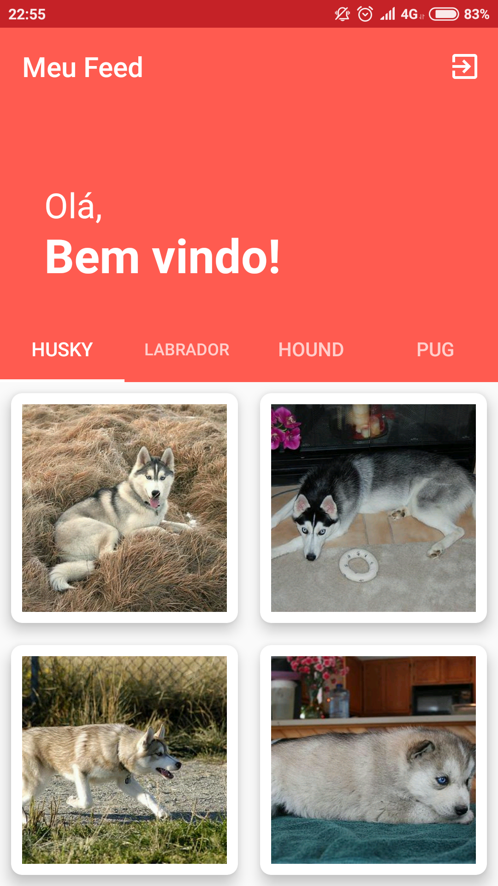
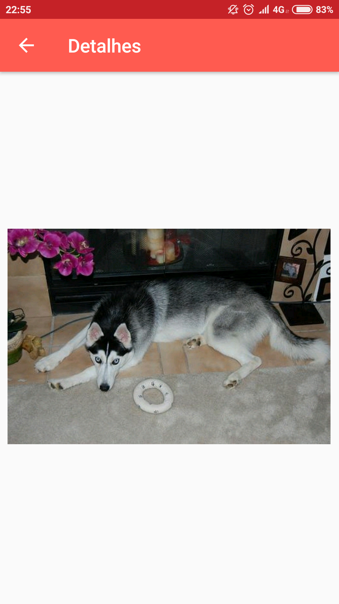

# IDWallDog
Projeto IDDog da startup [IDwall](https://idwall.co/), onde é feito autenticação por e-mail e posteriormente exibido uma lista com raças de cães. :D

# Instalação
- [APK](https://github.com/jonvieira/IDWallDog/raw/master/release/app-release.apk): Está anexado neste projeto o arquivo apk e também os arquivos de assinatura (keystore e keyAlias) que usei para gerar o arquivo. A apk pode ser baixado clicando [aqui](https://github.com/jonvieira/IDWallDog/raw/master/release/app-release.apk).

# ScreenShots

  
  
  
  

# Projeto
O projeto consiste em efetuar o login com um e-mail válido, e redirecionar para a tela de feed, onde é exibido uma lista com raças de cães. Ao ser clicado em uma das imagens, é redirecionado para outra tela onde a visualização ocupa a tela inteira. Para facilitar o acesso ao feed, também implementei o auto-login . :D
## Arquitetura
Neste projeto utilizei a arquitetura MVP + Clean Architecture pela facilidade de manutenção e futuras implementações.

## Bibliotecas

- [Butter Knife](https://github.com/JakeWharton/butterknife): Foi utilizado pois economizo tempo e código ao declarar o componente na view, dando uma visão de codigo limpo. Assim, consigo dispor mais tempo na regra do negócio, onde realmente importa
- [Retrofit](https://square.github.io/retrofit/): Biblioteca escolhida para requisições das APIs.
- [Gson](https://github.com/google/gson): Biblioteca da Google, para deserializar o retorno da API.
- [Glide](https://github.com/bumptech/glide): Escolhi a biblioteca Glide, pos gerencia melhor a memória do celular, além de fazer o cache de forma mais fácil, e ter suporte para arquivos GIF, para futuras implementações.

# Author

- Jonas Vieira - jonasvieira.ti@gmail.com  
 

